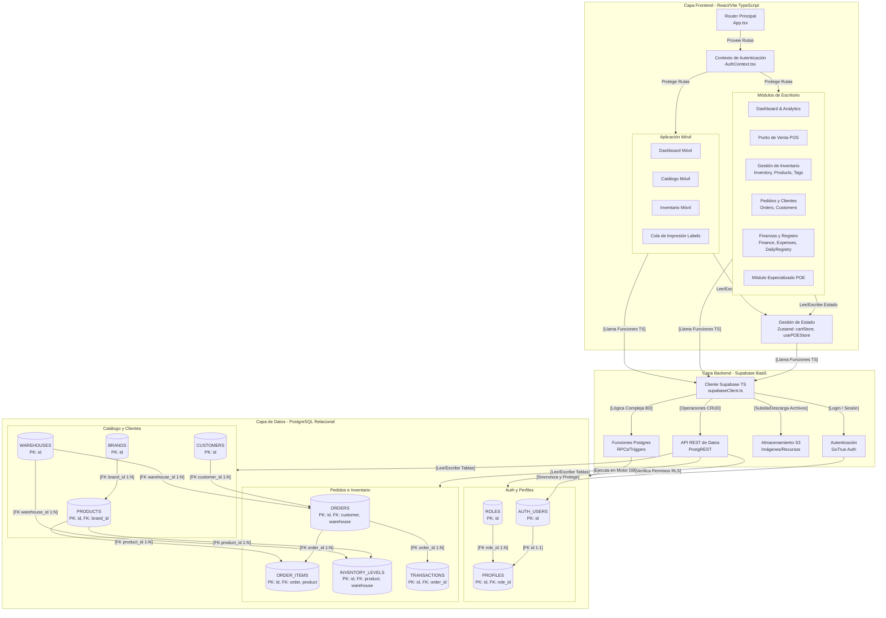

# Mapa de Arquitectura Completo - Sistema ERP

Este documento ilustra la arquitectura integral del sistema ERP, mostrando las capas de Frontend, Backend y Datos, junto con sus interconexiones, estado y esquemas relacionales.

## Diagrama Arquitectónico (Mermaid.js)

### Detalles de la Implementación

1. **FrontEnd_Tier**: Refleja tu estructura modular donde el enrutamiento base (`App.tsx`) distribuye a dos dominios principales (Escritorio vs. Móvil). Ambos ecosistemas acceden a estados globales y context providers compartidos (`cartStore`, `usePOEStore`).
2. **BackEnd_Tier**: Utilizas el cliente oficial de Supabase como proxy directo hacia la infraestructura Backend-as-a-Service, separando la lógica de Autenticación, Acceso a Datos y Storage de forma limpia sin necesitar un intermediario Node.js/Express.
3. **Data_Tier**: Refleja las agrupaciones relacionales del esquema en Markdown, enfatizando las Foráneas clave y demostrando cómo la API (PostgREST) fluye directamente a través de las validaciones de Row Level Security (RLS) hacia las tablas.
