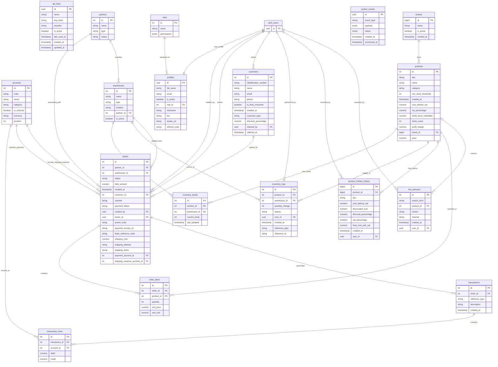

# Database a

```mermaid
erDiagram
    accounts {
        int id PK
        string code
        string name
        string category
        boolean is_nominal
        string currency
        int position
    }
    api_keys {
        uuid id PK
        string name
        string key_hash
        string provider
        boolean is_active
        timestamp last_used_at
        timestamp created_at
        timestamp updated_at
    }
    brands {
        bigint id PK
        string name
        boolean is_active
        timestamp created_at
    }
    customers {
        int id PK
        string identification_number
        string name
        string email
        string phone
        boolean is_final_consumer
        timestamp created_at
        string customer_type
        numeric discount_percentage
        uuid claimed_by FK
        timestamp claimed_at
    }
    inventory_levels {
        int id PK
        int product_id FK
        int warehouse_id FK
        int current_stock
        timestamp last_updated
    }
    inventory_logs {
        int id PK
        int product_id FK
        int warehouse_id FK
        int quantity_change
        string reason
        uuid user_id FK
        timestamp created_at
        string reference_type
        string reference_id
    }
    lost_demand {
        int id PK
        string search_term
        int product_id FK
        string reason
        string channel
        timestamp created_at
        uuid user_id FK
    }
    order_items {
        int id PK
        int order_id FK
        int product_id FK
        int quantity
        numeric unit_price
        numeric unit_cost
    }
    orders {
        int id PK
        int partner_id FK
        int warehouse_id FK
        string status
        numeric total_amount
        timestamp created_at
        int customer_id FK
        string channel
        string payment_status
        uuid created_by FK
        uuid closer_id FK
        string promo_code
        string payment_receipt_url
        string bank_reference_code
        numeric shipping_cost
        string shipping_address
        string shipping_notes
        int payment_account_id FK
        int shipping_expense_account_id FK
    }
    partners {
        int id PK
        string name
        string type
        string status
    }
    product_entries_history {
        bigint id PK
        bigint product_id FK
        string sku
        numeric cost_without_vat
        numeric discounted_cost
        numeric discount_percentage
        numeric vat_percentage
        numeric final_cost_with_vat
        timestamp created_at
        uuid user_id FK
    }
    products {
        int id PK
        string sku
        string name
        string category
        int min_stock_threshold
        timestamp created_at
        numeric cost_without_vat
        numeric vat_percentage
        numeric strike_price_candidate
        int strike_count
        numeric profit_margin
        bigint brand_id FK
        numeric price
    }
    profiles {
        uuid id PK
        string full_name
        string email
        boolean is_active
        int role_id FK
        string nickname
        string bio
        string avatar_url
        string referral_code
    }
    roles {
        int id PK
        string name
        jsonb permissions
    }
    system_events {
        uuid id PK
        string event_type
        jsonb payload
        string status
        timestamp created_at
        timestamp processed_at
    }
    transaction_lines {
        int id PK
        int transaction_id FK
        int account_id FK
        numeric debit
        numeric credit
    }
    transactions {
        int id PK
        int order_id FK
        string reference_type
        string description
        timestamp created_at
    }
    warehouses {
        int id PK
        string name
        string type
        string location
        int partner_id FK
        boolean is_active
    }
    auth_users {
        uuid id PK
    }

    brands ||--o{ products : owns
    products ||--o{ inventory_levels : has_levels
    warehouses ||--o{ inventory_levels : stores_levels
    products ||--o{ inventory_logs : logged_in
    warehouses ||--o{ inventory_logs : occurs_in
    products ||--o{ product_entries_history : has_history
    orders ||--o{ order_items : contains
    products ||--o{ order_items : included_in
    partners ||--o{ orders : associated_with
    warehouses ||--o{ orders : fulfilled_from
    customers ||--o{ orders : placed_by
    transactions ||--o{ transaction_lines : contains
    accounts ||--o{ transaction_lines : records_to
    orders ||--o{ transactions : generates
    partners ||--o{ warehouses : operates
    auth_users ||--|| profiles : has_profile
    roles ||--o{ profiles : assigned_to
    auth_users ||--o{ orders : created_by
    auth_users ||--o{ orders : closes
    auth_users ||--o{ customers : claims
    auth_users ||--o{ inventory_logs : performed_by
    auth_users ||--o{ product_entries_history : recorded_by
    products |o--o{ lost_demand : causes
    auth_users ||--o{ lost_demand : recorded_by
    accounts ||--o{ orders : receives_payment
    accounts ||--o{ orders : records_shipping_expense
```
